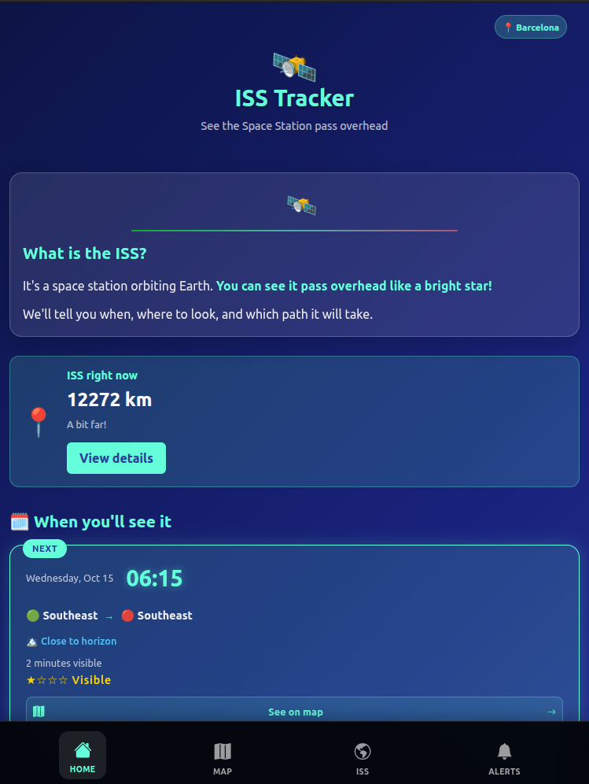
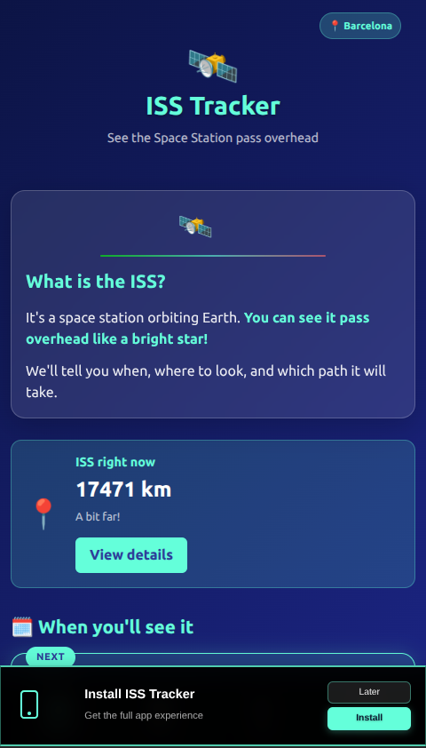
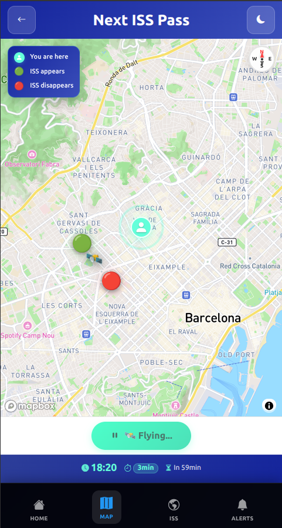
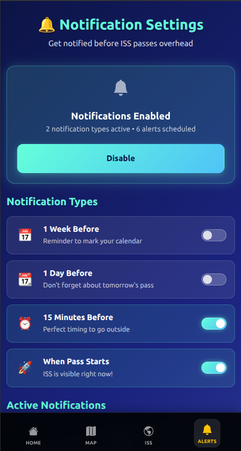

# ISS Tracker 🚀

**Track the International Space Station in real time**  
Progressive Web App built with **Angular 19**, **Bootstrap**, **Mapbox** & **satellite.js** — clean, mobile-first UX with no-nonsense visuals.

[🌐 Live Demo](https://iss-tracker-woad.vercel.app/home) · [📧 Contact](mailto:cdaniela.vd@gmail.com)

---

## What it does

Real-time ISS tracking with clean, intuitive UX. See where the Station is now, when it passes over you, and get desktop notifications before each pass. Fully installable as a PWA on any device.

**Key features**
- Live position on an interactive Mapbox view (calculations powered by `satellite.js`)
- Next **3 visible passes** with direction, duration & brightness hint
- **Desktop alerts** (Service Worker + Notifications API)
- **PWA installable** on iOS / Android / Desktop
- GPS or IP-based location with graceful fallback
- **ISS panel** with orbital data at a glance
- **Mobile-first responsive design**

---

## 📸 Screenshots

**Mobile — Install PWA**  

**Mobile — Map & tracking**  

**Mobile — Notifications**  

---

## 🧰 Tech Stack

| Category      | Tools / Libraries                              |
|---------------|-------------------------------------------------|
| Frontend      | **Angular 19**, Bootstrap 5                     |
| Mapping       | **Mapbox GL JS**, `satellite.js`                |
| Data source   | **Open Notify API** (fallback for ISS position) |
| PWA           | Angular Service Worker, Web App Manifest        |
| Hosting       | Vercel (CI/CD)                                  |

> This is a **100% frontend project** — no backend required.  
> Pass calculations run locally with `satellite.js`; the ISS tab uses the same data flow. Mapbox token is URL-restricted (Vercel + localhost).

---

## Architecture & Roadmap (frontend-first)

**Today — 100% frontend (Angular PWA):**  
- Pass calculations run locally using `satellite.js`  
- Map rendering via Mapbox (token URL-restricted)  
- Desktop alerts with Service Worker + Notifications API  
- **Open Notify** used as a **secondary/backup** source for ISS position (ensures robustness)

**Next — extend frontend superpowers:**  
- **.ICS calendar export** generated client-side  
- Improve **mobile** alert support (push notifications may require a tiny backend later)

✨ This project shows how far modern frontend can go — and it’s just the beginning.

---

## Version

**v1.1 — Stable & improving**  
- Pass calculations and desktop alerts are fully functional  
- **.ICS calendar export** is the next feature to ship

---

## Try it

👉 [iss-tracker-woad.vercel.app/home](https://iss-tracker-woad.vercel.app/home)  
On mobile, tap **Install** to get the full PWA experience 🚀

---

## Author

Built with joy by **Daniela Villarreal**  
Frontend Developer · UX-first mindset · Clean code & playful details  
[GitHub](https://github.com/deuvede24) · [LinkedIn](https://www.linkedin.com/in/danielavillarrealdiaz/) · [cdaniela.vd@gmail.com](mailto:cdaniela.vd@gmail.com)

---

<!-- Image files expected at: assets/screens/ -->
<!-- desktop-hero.png | mobile-home-install.png | mobile-map.png | notification-settings.png -->
